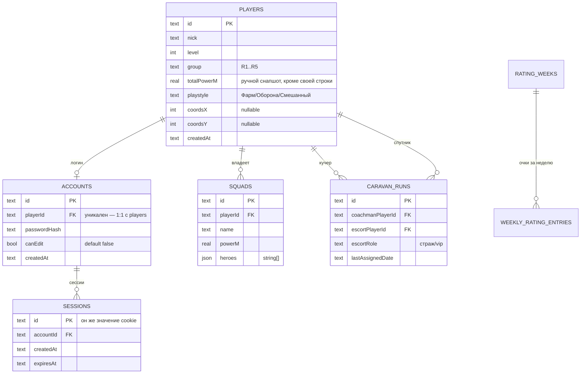

# База данных

SQLite (файл, путь задаётся `DB_PATH`) через Drizzle. Источник истины — `server/src/db/schema.ts`; этот файл может отставать от него, при расхождении верить коду. Термины (`Account` vs `AlliancePlayer`, право редактирования и т.д.) — в [`CONTEXT.md`](../CONTEXT.md). Причины архитектурных решений — в [`docs/adr/`](./adr/).

## Схема целиком

Остальные пять таблиц — CSV-импортируемые снапшоты (см. ниже), не связаны через FK с `players` (сопоставляются по `nick` на лету): `elixir_race_entries`, `formation_tiles`, `rating_weeks` + `weekly_rating_entries`, `contribution_entries`, `player_stats`.

## Таблицы

### `players` — ростер альянса

Строка ростера ≠ логин (см. `accounts`). Существует до регистрации — её должен завести редактор (или bootstrap-скрипт), прежде чем игрок сможет зарегистрироваться.

| Колонка | Тип | Nullable | По умолчанию | Описание |
|---|---|---|---|---|
| `id` | text (nanoid) | нет | — | PK |
| `nick` | text | нет | — | Уникален по факту (проверяется в коде при регистрации/смене ника), но без DB-constraint |
| `level` | integer | нет | — | |
| `group` | text (`PlayerGroup`: `R1`\|`R2`\|`R3`\|`R4`\|`R5`) | нет | — | Смена своей группы требует `canEdit` — в игре её назначают R4-R5 |
| `totalPowerM` | real | нет | `0` | **Ручной снапшот** для всех строк, КРОМЕ строки текущего вызывающего — та всегда пересчитывается на лету как сумма его же `squads.powerM` (см. `listPlayersWithPower` в `routers/players.ts`) |
| `playstyle` | text (`Playstyle`: `Фарм`\|`Оборона`\|`Смешанный`) | нет | — | |
| `coordsX`, `coordsY` | integer | да | — | Координаты базы игрока, самостоятельно редактируются |
| `createdAt` | text (ISO datetime) | нет | `current_timestamp` | |

### `accounts` — логин

1:1 с `players` (`playerId` — уникальный индекс). Именно здесь, а не на `players`, живёт право редактирования.

| Колонка | Тип | Nullable | По умолчанию | Описание |
|---|---|---|---|---|
| `id` | text (nanoid) | нет | — | PK |
| `playerId` | text FK → `players.id`, `ON DELETE CASCADE` | нет | — | Уникальный индекс `accounts_player_id_idx` |
| `passwordHash` | text | нет | — | bcrypt |
| `canEdit` | boolean (integer 0/1) | нет | `false` | Единый флаг на всё редактирование чужих данных (не матрица прав) — выдаётся точечно. Первая регистрация под `BOOTSTRAP_ADMIN_NICK` получает `true` автоматически |
| `createdAt` | text | нет | `current_timestamp` | |

### `sessions` — активные сессии

| Колонка | Тип | Nullable | По умолчанию | Описание |
|---|---|---|---|---|
| `id` | text (случайный токен, 48 символов nanoid) | нет | — | PK. **Это и есть значение cookie** `remedium_session` |
| `accountId` | text FK → `accounts.id`, `ON DELETE CASCADE` | нет | — | |
| `createdAt` | text | нет | `current_timestamp` | |
| `expiresAt` | text (ISO datetime) | нет | — | Фиксированный TTL 30 дней от создания (не скользящий) |

### `squads` — отряды игрока

| Колонка | Тип | Nullable | По умолчанию | Описание |
|---|---|---|---|---|
| `id` | text (nanoid) | нет | — | PK |
| `playerId` | text FK → `players.id`, `ON DELETE CASCADE` | нет | — | Владелец — редактирует только он сам (или редактор) |
| `name` | text | нет | — | `"Отряд N"`, N — следующий свободный номер среди отрядов этого игрока |
| `powerM` | real | нет | — | Мощь отряда, в миллионах |
| `heroes` | json (`string[]`, ровно 5 элементов) | нет | — | Пустой слот — `''` |

### `caravan_runs` — история назначений каравана

Двухшаговый флоу (`roll` → `confirm`) не хранит черновик в БД — сохраняется только подтверждённый результат.

| Колонка | Тип | Nullable | По умолчанию | Описание |
|---|---|---|---|---|
| `id` | text (nanoid) | нет | — | PK |
| `coachmanPlayerId` | text FK → `players.id`, `ON DELETE CASCADE` | нет | — | Кучер |
| `escortPlayerId` | text FK → `players.id`, `ON DELETE CASCADE` | нет | — | Спутник |
| `escortRole` | text (`CaravanEscortRole`: `страж`\|`vip`) | нет | — | Правило выбора между ними — плейсхолдер (честный coin-flip), реальная логика ещё не определена |
| `lastAssignedDate` | text (`YYYY-MM-DD`) | нет | — | |

---

## CSV-импортируемые снапшоты

Общее: заполняются офицером через `POST /api/import/:resource` (требует `canEdit`), не через CRUD в приложении. Не связаны FK с `players` — сопоставление с текущим пользователем (`isSelf`) происходит на лету по совпадению `nick` при чтении. `nick` здесь может не входить в `players` вовсе (пул шире отслеживаемого ростера).

**Замена целиком при каждом импорте**: `elixir_race_entries`, `formation_tiles`, `contribution_entries`, `player_stats`.
**Исключение — накопительно по неделям**: `weekly_rating_entries` (импорт указывает `weekStart`, затрагивает только эту неделю).

### `elixir_race_entries`

| Колонка | Тип | Описание |
|---|---|---|
| `id` | text (nanoid) | PK |
| `nick` | text | |
| `level` | integer | |
| `team` | text (`ElixirTeam`: `Основа А`\|`Основа Б`\|`Резерв А`\|`Резерв Б`\|`Не зарегистрирован`) | |
| `participation` | text (`ElixirParticipation`: `Да`\|`Нет`\|`Не знает`) | |

### `formation_tiles`

| Колонка | Тип | Описание |
|---|---|---|
| `id` | text (nanoid) | PK |
| `x`, `y` | integer | Координаты на карте построения |
| `nick` | text | |
| `power` | integer, nullable | `null`, если не удалось разобрать со скриншота |
| `role` | text (`FormationRole`: `attacker`\|`mixed`\|`defender`\|`none`) | |

### `rating_weeks` + `weekly_rating_entries`

Нормализовано на две таблицы, чтобы можно было импортировать по одной неделе за раз, не трогая остальные.

**`rating_weeks`**

| Колонка | Тип | Описание |
|---|---|---|
| `id` | text (nanoid) | PK |
| `label` | text | Подпись недели (по умолчанию = `weekStart`) |
| `weekStart` | text, **unique** | Дата начала недели, естественный ключ импорта |

**`weekly_rating_entries`**

| Колонка | Тип | Описание |
|---|---|---|
| `id` | text (nanoid) | PK |
| `weekId` | text FK → `rating_weeks.id`, `ON DELETE CASCADE` | |
| `nick` | text | |
| `points` | integer | |

При чтении (`weeklyRating.list`) берутся последние 5 записей `rating_weeks` (по `weekStart` desc), для каждого `nick` собирается массив очков по этим неделям, пропуски заполняются нулём.

### `contribution_entries`

| Колонка | Тип | Описание |
|---|---|---|
| `id` | text (nanoid) | PK |
| `nick` | text | |
| `group` | text (`PlayerGroup`) | Группа на момент импорта — может отличаться от текущей `players.group` |
| `points` | integer | Очки рейтинга дуэлей альянса, суммарно |

### `player_stats`

Дуэльная статистика на странице профиля (`ProfileStats`, кроме `lastCoachmanDate` — та вычисляется из `caravan_runs`, не хранится отдельно). Добавлена по аналогии с остальными снапшотами, не обсуждалась явно.

| Колонка | Тип | Описание |
|---|---|---|
| `id` | text (nanoid) | PK |
| `nick` | text | |
| `avgDuelScore` | integer | |
| `avgDuelRank` | integer | |
| `strongerThanPercent` | integer | |
| `weeklyPowerChangePercent` | real | |

---

## Общие приёмы

- **ID** — везде `nanoid()`, тип колонки `text`.
- **Enum-подобные поля** — хранятся как `text`, но в Drizzle-схеме размечены `.$type<...>()` литеральным union-типом (не настоящий SQL CHECK/enum — валидация только на уровне приложения, через zod во входных схемах tRPC/импорта).
- Эти union-типы **продублированы** в `server/src/db/schema.ts` и в `app/src/lib/api/types.ts` — сервер намеренно не зависит от кода фронта (только фронт type-only импортирует `AppRouter` из сервера), так что при добавлении нового варианта (например, новой `PlayerGroup`) поправить нужно в обоих местах.
- Миграции — Drizzle Kit, файлы в `server/drizzle/`, генерируются через `npm run db:generate`, применяются через `npm run db:migrate` (на проде — автоматически при старте контейнера, см. `Dockerfile`).
