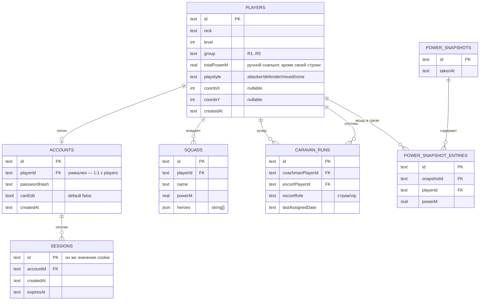

# База данных

SQLite (файл, путь задаётся `DB_PATH`) через Drizzle. Источник истины — `server/src/db/schema.ts`; этот файл может отставать от него, при расхождении верить коду. Термины (`Account` vs `AlliancePlayer`, право редактирования, «Вклад», «Стиль игры», «Срез мощи» и т.д.) — в [`CONTEXT.md`](../CONTEXT.md). Причины архитектурных решений — в [`docs/adr/`](./adr/).

## Схема целиком

Остальные две таблицы — CSV-импортируемые снапшоты (см. ниже), не связаны через FK с `players` (сопоставляются по `nick` на лету): `elixir_race_entries`, `contribution_entries`. Плюс отдельно — `settings`, generic key-value конфиг без FK и без снапшот-семантики.

## Таблицы

### `players` — ростер альянса

Строка ростера ≠ логин (см. `accounts`). Существует до регистрации — её должен завести редактор (или bootstrap-скрипт), прежде чем игрок сможет зарегистрироваться.

| Колонка | Тип | Nullable | По умолчанию | Описание |
|---|---|---|---|---|
| `id` | text (nanoid) | нет | — | PK |
| `nick` | text | нет | — | Уникален по факту (проверяется в коде при регистрации/смене ника), но без DB-constraint |
| `level` | integer | нет | — | |
| `group` | text (`PlayerGroup`: `R1`\|`R2`\|`R3`\|`R4`\|`R5`) | нет | — | Смена своей группы требует `canEdit` — в игре её назначают R4-R5. Пороги перехода между группами — см. `settings` ниже, они не назначают группу автоматически |
| `totalPowerM` | real | нет | `0` | **Ручной снапшот** для всех строк, КРОМЕ строки текущего вызывающего — та всегда пересчитывается на лету как сумма его же `squads.powerM` (см. `sumPowerByPlayer`/`listPlayersWithPower` в `routers/players.ts`) |
| `playstyle` | text (`Playstyle`: `attacker`\|`defender`\|`mixed`\|`none`) | нет | — | «Стиль игры» (см. CONTEXT.md, ADR 0005) — единственное поле на весь проект, формация читает его же по нику вместо собственного хранимого поля |
| `coordsX`, `coordsY` | integer | да | — | Координаты базы игрока на карте мира. Редактирует только `canEdit` (вкладка «Игроки», см. ADR 0007) — не сам игрок. Источник координат для вкладки «Формация» (строки без обеих координат на ней не показываются) |
| `createdAt` | text (ISO datetime) | нет | `current_timestamp` | |

### `accounts` — логин

1:1 с `players` (`playerId` — уникальный индекс). Именно здесь, а не на `players`, живёт право редактирования.

| Колонка | Тип | Nullable | По умолчанию | Описание |
|---|---|---|---|---|
| `id` | text (nanoid) | нет | — | PK |
| `playerId` | text FK → `players.id`, `ON DELETE CASCADE` | нет | — | Уникальный индекс `accounts_player_id_idx` |
| `passwordHash` | text | нет | — | bcrypt |
| `canEdit` | boolean (integer 0/1) | нет | `false` | Единый флаг на всё редактирование чужих данных (не матрица прав) — выдаётся точечно. Первая регистрация под `BOOTSTRAP_ADMIN_NICK` получает `true` автоматически |
| `createdAt` | text | нет | `current_timestamp` | |

### `sessions` — активные сессии

| Колонка | Тип | Nullable | По умолчанию | Описание |
|---|---|---|---|---|
| `id` | text (случайный токен, 48 символов nanoid) | нет | — | PK. **Это и есть значение cookie** `remedium_session` |
| `accountId` | text FK → `accounts.id`, `ON DELETE CASCADE` | нет | — | |
| `createdAt` | text | нет | `current_timestamp` | |
| `expiresAt` | text (ISO datetime) | нет | — | Фиксированный TTL 30 дней от создания (не скользящий) |

### `squads` — отряды игрока

| Колонка | Тип | Nullable | По умолчанию | Описание |
|---|---|---|---|---|
| `id` | text (nanoid) | нет | — | PK |
| `playerId` | text FK → `players.id`, `ON DELETE CASCADE` | нет | — | Владелец — редактирует только он сам (или редактор) |
| `name` | text | нет | — | `"Отряд N"`, N — следующий свободный номер среди отрядов этого игрока |
| `powerM` | real | нет | — | Мощь отряда, в миллионах. Сумма по игроку — источник и «живой» `totalPowerM`, и «Среза мощи» |
| `heroes` | json (`string[]`, ровно 5 элементов) | нет | — | Пустой слот — `''` |

### `caravan_runs` — история назначений каравана

Двухшаговый флоу (`roll` → `confirm`) не хранит черновик в БД — сохраняется только подтверждённый результат.

| Колонка | Тип | Nullable | По умолчанию | Описание |
|---|---|---|---|---|
| `id` | text (nanoid) | нет | — | PK |
| `coachmanPlayerId` | text FK → `players.id`, `ON DELETE CASCADE` | нет | — | Кучер |
| `escortPlayerId` | text FK → `players.id`, `ON DELETE CASCADE` | нет | — | Спутник |
| `escortRole` | text (`CaravanEscortRole`: `страж`\|`vip`) | нет | — | Правило выбора между ними — плейсхолдер (честный coin-flip), реальная логика ещё не определена |
| `lastAssignedDate` | text (`YYYY-MM-DD`) | нет | — | |

### `power_snapshots` + `power_snapshot_entries` — «Срез мощи»

См. CONTEXT.md «Срез мощи», ADR 0004. Периодическая ручная фиксация (кнопка в UI, `canEdit`-only, `powerSnapshot.create`) суммарной боевой мощи всех игроков разом — независимая от «Вклада» сущность, каданс которой определяет офицер (не обязательно раз в неделю). Два последних `power_snapshots` — база для `weeklyPowerChangePercent` на странице профиля.

В отличие от CSV-снапшотов ниже, эти таблицы **честно связаны FK с `players`**, а не сопоставляются по нику — значения приходят из живой суммы `squads.powerM`, а не из стороннего файла.

**`power_snapshots`**

| Колонка | Тип | Описание |
|---|---|---|
| `id` | text (nanoid) | PK |
| `takenAt` | text (ISO datetime) | По умолчанию `current_timestamp` |

**`power_snapshot_entries`**

| Колонка | Тип | Описание |
|---|---|---|
| `id` | text (nanoid) | PK |
| `snapshotId` | text FK → `power_snapshots.id`, `ON DELETE CASCADE` | |
| `playerId` | text FK → `players.id`, `ON DELETE CASCADE` | |
| `powerM` | real | Мощь игрока (сумма его `squads.powerM`) на момент среза |

### `settings` — generic конфиг альянса

Key-value хранилище (см. ADR 0006) — сейчас содержит только пороги групп (`groupThresholdR1R2`, `groupThresholdR2R3`), но специально не типизировано под конкретные ключи, чтобы будущие настройки не требовали новой миграции. Читать может любой залогиненный (`settings.get`), писать — только `canEdit` (`settings.update`, upsert по ключу).

| Колонка | Тип | Описание |
|---|---|---|
| `key` | text | PK |
| `value` | text | Хранится как строка независимо от смысла значения (сейчас — числа, распарсенные на фронте) |

---

## CSV-импортируемые снапшоты

Общее: заполняются офицером через `POST /api/import/:resource` (требует `canEdit`), не через CRUD в приложении. Не связаны FK с `players` — сопоставление с текущим пользователем (`isSelf`) происходит на лету по совпадению `nick` при чтении. `nick` здесь может не входить в `players` вовсе (пул шире отслеживаемого ростера). Подробности формата и запросов — [`docs/csv-import.md`](./csv-import.md).

**Замена целиком при каждом импорте**: `elixir_race_entries`.
**Исключение — накопительно по неделям**: `contribution_entries` (импорт указывает `weekStart`, затрагивает только строки этой недели).

(«Формация» раньше была третьим таким CSV-снапшотом, `formation_tiles` — см. ADR 0007 про переход на живое чтение `players.coords_x/y`.)

### `elixir_race_entries`

| Колонка | Тип | Описание |
|---|---|---|
| `id` | text (nanoid) | PK |
| `nick` | text | |
| `level` | integer | |
| `team` | text (`ElixirTeam`: `Основа А`\|`Основа Б`\|`Резерв А`\|`Резерв Б`\|`Не зарегистрирован`) | |
| `participation` | text (`ElixirParticipation`: `Да`\|`Нет`\|`Не знает`) | |

### `contribution_entries` — «Вклад»

См. CONTEXT.md «Вклад», ADR 0003. Одна строка = очки одного игрока за одну неделю. Заменяет прежние раздельные «рейтинг» и «вклад» — питает и вкладку «Рейтинг игроков» (история последних 5 недель, `contribution.history`), и «Анализ вклада» (только последняя неделя, `contribution.list`).

| Колонка | Тип | Описание |
|---|---|---|
| `id` | text (nanoid) | PK |
| `nick` | text | Вместе с `weekStart` — уникальный индекс `contribution_entries_nick_week_idx` |
| `weekStart` | text (`YYYY-MM-DD`) | Дата начала недели, естественный ключ накопления. Повторная заливка с тем же `weekStart` перезаписывает только эту неделю |
| `points` | integer | Очки за эту неделю |

`group` здесь не хранится — это живой атрибут игрока (`players.group`), а не факт про прошлую неделю; на чтении джойнится по нику. `avgDuelScore`/`avgDuelRank` на странице профиля — не поля этой таблицы, а среднее по всей истории (см. ниже).

---

## Вычисляемые метрики профиля (не отдельная таблица)

Раньше `strongerThanPercent`, `weeklyPowerChangePercent`, `avgDuelScore`, `avgDuelRank` жили в отдельной таблице `player_stats` как ручной CSV-снапшот. Таблицы больше нет (см. ADR 0004) — все четыре величины считаются на лету в `profile.get`/`server/src/trpc/routers/profileStats.ts`, `null` вместо значения, если данных ещё недостаточно:

- `strongerThanPercent` — доля игроков альянса (кроме себя и кроме тех, у кого мощь 0) с живой суммой `squads.powerM` меньше своей.
- `weeklyPowerChangePercent` — изменение своей суммы `squads.powerM` между двумя последними `power_snapshots`.
- `avgDuelScore` / `avgDuelRank` — среднее очков / среднего места по всей истории `contribution_entries` этого ника (место — позиция по убыванию очков среди участников той недели, недели без участия не считаются).

---

## Общие приёмы

- **ID** — везде `nanoid()`, тип колонки `text`.
- **Enum-подобные поля** — хранятся как `text`, но в Drizzle-схеме размечены `.$type<...>()` литеральным union-типом (не настоящий SQL CHECK/enum — валидация только на уровне приложения, через zod во входных схемах tRPC/импорта).
- Эти union-типы **продублированы** в `server/src/db/schema.ts` и в `app/src/lib/api/types.ts` — сервер намеренно не зависит от кода фронта (только фронт type-only импортирует `AppRouter` из сервера), так что при добавлении нового варианта (например, новой `PlayerGroup`) поправить нужно в обоих местах.
- Миграции — Drizzle Kit, файлы в `server/drizzle/`, генерируются через `npm run db:generate`, применяются через `npm run db:migrate` (на проде — автоматически при старте контейнера, см. `Dockerfile`).
